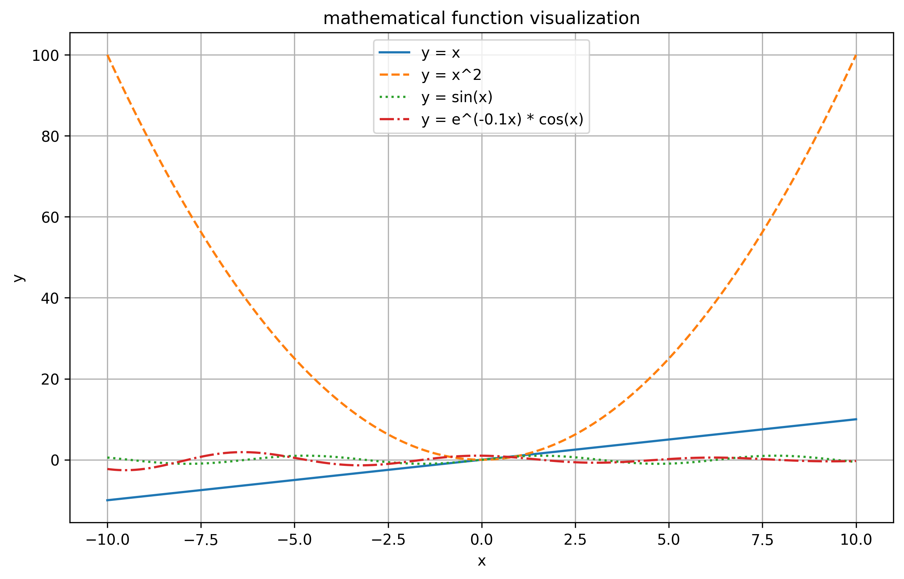
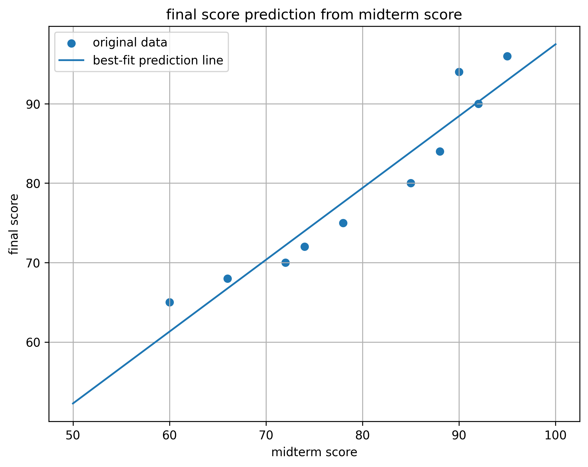

# math visualization assignment

## project description

this project is for a python visualization assignment. it shows mathematical functions, my own equation, student score data, and a simple prediction line.

## libraries used

- numpy
- matplotlib

## how to run the code

first install the libraries:

```bash
pip install numpy matplotlib
```

then run the python file:

```bash
python math_visualization.py
```

or open the notebook in google colab and run each part one by one.

## screenshots

### function plot



### score prediction



## short explanation

visualization helps us understand mathematical functions and data because we can see patterns more clearly. for example, a graph shows how a function changes when x changes. for data, plots help us compare values and find trends faster than only looking at numbers.

the most useful plot in this assignment was the best-fit line plot. it was useful because it showed the relationship between midterm scores and final scores. it also helped make simple predictions for new midterm scores.

numpy was used to create number ranges, calculate functions, store score data, and find the best-fit line. matplotlib was used to draw all the graphs and save them as image files.
